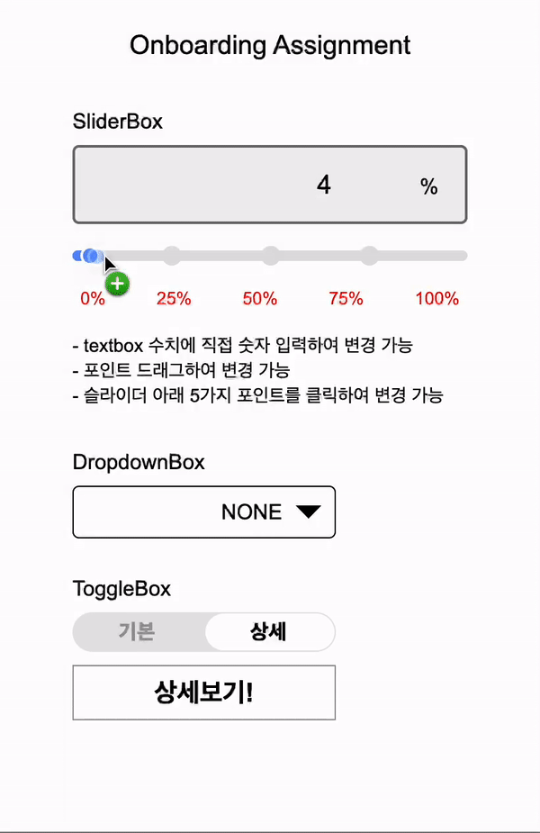

# Wanted Onboarding Assignment

## SliderBox

### 소개

- input 태그를 사용하지 않고 제작!
- 여러가지 모양으로 커스텀이 가능.
- 숫자를 직접 입력하면 슬라이더가 실시간으로 적용.
- 포인터를 눌러 drag 하여 표시도 가능.
- 5가지 숫자를 누르면 해당 위치로 슬라이더가 반영.

### 슬라이더 드래그로 이동 구현 방법

- dragstart 로 시작 위치를 설정하고
- dragover 를 통해 시작 위치로 부터 움직인 값을 구하여 현재 위치로부터 움직인 값 만큼 이동시킨다.
- dragend 이벤트를 통해 현재 위치를 다시 저장한다.

### 텍스트 상태 표시 구현 방법

- 차지한 너비 / 전체 너비 \* 100으로 상태값을 계속 변경시켜준다.
- 변경되는 상태값은 text로 표시된다.
- text를 변경하면 상태값이 변경되고
- 변경된 상태값은 상태값/100\*300 으로 계산되어 너비에 적용된다.

## DropdownBox

- 드롭다운 선택
- 검색어 입력하면 실시간 검색 결과 반영

## ToggleBox

### 구현 방법

- 글자와 seleted 요소만 position으로 띄우고 글자만 z-index로 더 위에 보이도록 구현!

## 시현

